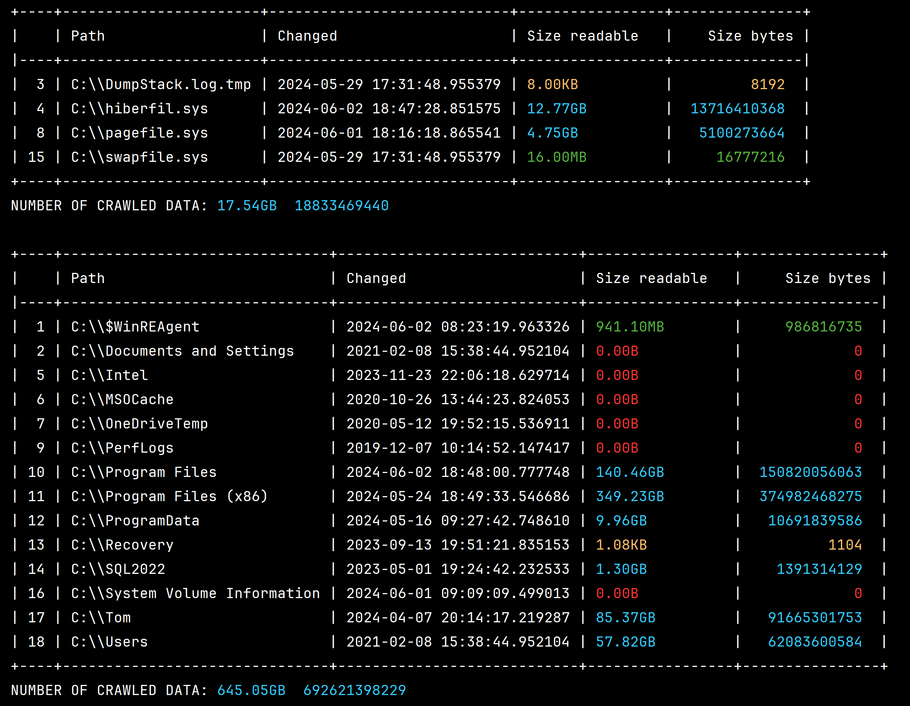

# Aim of the project
I got tired of using Windows explorer search toolbar and also there was a need both
at home and at work to be more efficient in searching for files/folders. Also, since
this project is not a large scale one, I was trying/training to write the code with
great focus on readability, modularity and testability.

# Process
There is a crawler which runs through files and folders at given path.
Optionally the crawler can run in subdirectories as well.
There is implemented multiprocessing to speed up the crawling.
Crawled data (paths, dates, sizes) are collected and put into pandas
dataframes. Results are then saved into csv files.
The results can be filtered and printed into console in tabular format.

# Status of the project
Functional

# Result:
